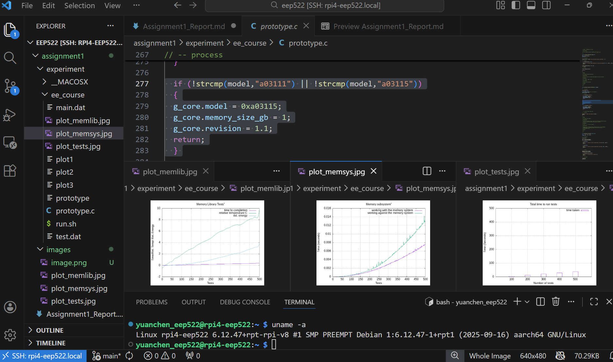
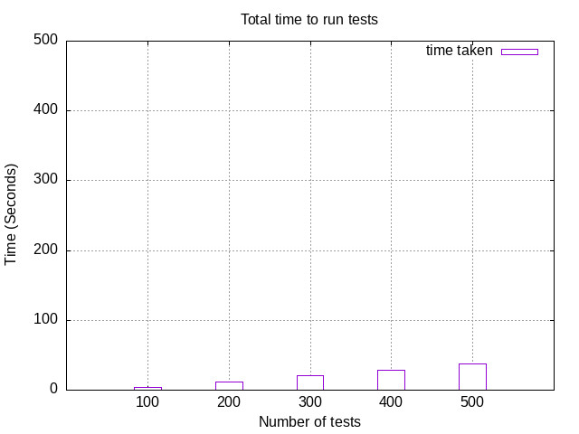
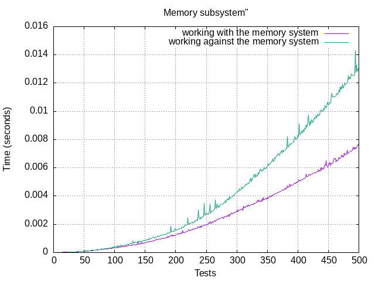
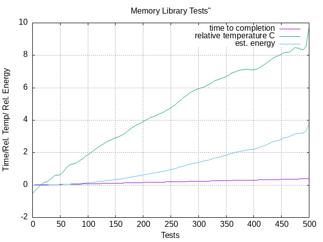

# EEP 522 – Assignment 1: System Configuration

**Author:** Yu-An Chen  
**Contact:** yuan1230@uw.edu  
**Course:** EEP 522 – Embedded And Real Time Systems  
**Platform:** Raspberry Pi 4 Model B (1GB)  
**Date:** January 25, 2026  

---

## Abstract

This assignment documents the configuration of a Raspberry Pi 4 Model B as a headless embedded development platform.  
The objective was to install and configure the operating system, establish remote communication, enable cross-development from a host machine, and execute a performance experiment.  

Unlike a traditional setup, most initialization steps were completed during the Raspberry Pi Imager installation phase, which significantly reduced manual configuration.  
The system was successfully configured using SSH-based access, Visual Studio Code Remote SSH for development, and GitHub for version control.  

An experimental workload was executed and visualized using gnuplot. During execution, a hardware revision mismatch was identified and corrected in the source code to support the target board.

---

## 1. Introduction

Embedded systems development requires a stable, reproducible, and well-documented hardware and software environment.  
The purpose of this assignment is to configure a Raspberry Pi as a headless embedded Linux platform suitable for development, experimentation, and performance evaluation.

This configuration serves as the foundation for subsequent assignments. Emphasis was placed on minimizing manual setup, leveraging modern tooling, and documenting all challenges encountered during system bring-up.

---

## 2. Hardware and Software Setup

### 2.1 Hardware

- Raspberry Pi 4 Model B (1GB RAM)
- microSD card (32GB)
- Power supply compatible with Raspberry Pi 4
- WiFi network connection
- Host machine running Windows

### 2.2 Software

- Raspberry Pi OS 32-bit
- OpenSSH
- GNU Compiler Collection (gcc)
- Visual Studio Code (Remote SSH)
- Git and GitHub
- Gnuplot

---

## 3. Operating System Installation

Raspberry Pi OS (32-bit) was installed using the Raspberry Pi Imager tool.  
During the imaging process, the following configurations were completed:

- Username and password creation
- WiFi network configuration
- SSH enabled
- Hostname set
- Locale and keyboard layout set to English (US)

As a result, many steps described in the assignment handout (manual WiFi setup, hostname change, SSH installation) were already completed before first boot.

After installation, the system was verified using:

```
yuanchen_eep522@rpi4-eep522:~ $ uname -a

Linux rpi4-eep522 6.12.47+rpt-rpi-v8 #1 SMP PREEMPT Debian 1:6.12.47-1+rpt1 (2025-09-16) aarch64 GNU/Linux
```

Although the OS installed was 32-bit, the kernel reported an aarch64 architecture. This behavior is expected on Raspberry Pi 4, where a 64-bit kernel may be used with a 32-bit userland.

---

## 4. Headless System Configuration

To configure the Raspberry Pi as a headless embedded system:

- The graphical desktop environment was disabled.
- Console auto-login was enabled using `sudo raspi-config`.
- SSH access was enabled to allow remote login.
- System packages were updated and upgraded after reboot.

After reboot, the system booted directly into a terminal without requiring a display, keyboard, or mouse.

System updates were performed using the following commands:
```
sudo apt update
sudo apt upgrade
```
These steps ensured that all installed packages were up to date before further configuration and experimentation.

Remote access was verified using SSH:

` ssh yuanchen_eep522@rpi4-eep522.local `

---

## 5. Communication and Development Environment

### 5.1 SSH Communication

Secure Shell (SSH) was used as the primary communication mechanism between the host machine and the Raspberry Pi.  
This enabled remote login, file transfer, and command execution.

### 5.2 Cross-Development Environment

A cross-development workflow was established using:

- SSH for remote access
- gcc for native compilation on the Raspberry Pi
- Visual Studio Code with the Remote SSH extension

This setup allowed editing, compiling, and executing code directly on the Raspberry Pi from the host machine.

A simple “Hello World” program was compiled and executed successfully to verify the toolchain.
```
yuanchen_eep522@rpi4-eep522:~/eep522/assignment1 $ gcc hellow.c -o hellow
yuanchen_eep522@rpi4-eep522:~/eep522/assignment1 $ ./hellow
hello_world
```

---

## 6. Experiment Execution

### 6.1 Experiment Setup


The provided experiment archive (`A1_source.zip`) was transferred to the Raspberry Pi and organized under the following structure:
```
eep522/
└── assignment1/
   └── experiment/
      └── A1_source.zip
```

Commands used:
```
scp A1_source.zip yuanchen_eep522@rpi4-eep522.local:~/eep522/assignment1/
cd ~/eep522/assignment1
mkdir experiment
mv A1_source.zip experiment/
cd experiment
unzip A1_source.zip
```
Gnuplot was installed using:
```
sudo apt install gnuplot
```
---

### 6.2 Initial Failure and Root Cause Analysis

The experiment was executed using:

`./run.sh`

> The script was located inside the `ee_course` directory, which was created after extracting `A1_source.zip` into the `assignment1/experiment` directory.

However, the generated plots were empty.  
Inspection of the program output revealed the following error:

`-- E: model type unknown a03115`

This indicated that the Raspberry Pi 4 Model B (1GB) revision code (`a03115`) was not recognized by the program.

---


### 6.3 Code Modification

To resolve this issue, the model translation logic in `prototype.c` was updated.

Original logic only supported revision `a03111`.  
Although a03111 and a03115 are distinct hardware revision codes, both correspond to Raspberry Pi 4 Model B with identical memory configuration and CPU architecture. Since the experiment only depends on memory size and access behavior, both revisions can be safely mapped to the same internal model representation.
The following modification was applied:
```
if (!strcmp(model,"a03111") || !strcmp(model,"a03115"))
{
    g_core.model = 0xa03115;
    g_core.memory_size_gb = 1;
    g_core.revision = 1.1;
    return;
}
```

This change allows the program to correctly identify both revision codes as Raspberry Pi 4 Model B (1GB).  
Since both revisions share the same memory configuration, treating them equivalently is valid and resolves the execution failure.

After recompilation, the experiment completed successfully and produced valid data and plots.


---

## 7. Results

The experiment took around 5 minutes to generate multiple plots illustrating:

- Execution time trends
- Cache-friendly vs cache-unfriendly memory access patterns
- Temperature variation relative to baseline

The results confirm that the system was operating correctly and that the workload executed as expected.
|  |  |  |
| :---: | :---: | :---: |
| plot_tests.jpg | plot_memsys.jpg | plot_memlib.jpg |


---

## 8. Discussion

Several challenges were encountered during this assignment:

- Incorrect user creation during initial setup (details documented in Appendices)
- Confusion regarding 32-bit OS versus 64-bit kernel reporting
- Unsupported hardware revision code in the provided experiment
- Empty output plots due to early program termination

Each issue was resolved through systematic debugging, documentation review, and source code inspection.  
This process reinforced the importance of understanding system initialization details and hardware identifiers in embedded Linux environments.

---

## 9. Safe Shutdown Procedure

To prevent filesystem corruption, the system was always shut down using the following command before power removal:

`sudo halt`

This ensured that all filesystem buffers were flushed and the system entered a safe state prior to disconnecting power.

---

## 10. Version Control

All coursework files were managed using Git and stored in a private GitHub repository.  
Version control was used to prevent data loss and to track incremental changes throughout system configuration and experimentation.

---

## 9. Conclusion

This assignment successfully established a complete and reproducible embedded development environment on a Raspberry Pi 4 Model B operating in headless mode.  
By leveraging Raspberry Pi Imager for initial configuration, many traditionally manual steps—such as WiFi setup, SSH enablement, and hostname configuration—were completed prior to first boot, significantly simplifying system bring-up.

Remote development was enabled using SSH and Visual Studio Code, allowing source code editing, compilation, and execution without requiring direct physical access to the board.  
A cross-development workflow was validated through successful compilation and execution of test programs and experimental workloads.

During experimentation, an unsupported hardware revision code was identified and resolved through a careful analysis of hardware equivalence and software abstraction.  
By mapping functionally identical Raspberry Pi revisions to a common internal representation, the experiment was able to execute correctly and generate meaningful performance data.

All configuration steps, debugging decisions, and commands were documented to ensure reproducibility and long-term maintainability.  
The resulting system provides a stable foundation for subsequent assignments involving embedded software development, performance analysis, and system-level experimentation.


---

## 11. References

1. Raspberry Pi OS – Updating and Upgrading Software  
   https://www.raspberrypi.com/documentation/computers/os.html#update-software  
   (Reference for using `sudo apt update` and `sudo apt upgrade` on Raspberry Pi OS)

2. Raspberry Pi OS – Headless Setup and SSH Configuration  
   https://www.raspberrypi.com/documentation/computers/remote-access.html  
   (Reference for enabling SSH and remote access without a monitor)

4. Secure Shell (SSH) – Protocol and Usage  
   https://www.openssh.com/manual.html  
   (Reference for SSH-based remote login and secure communication)

6. Gnuplot – Official Documentation  
   http://www.gnuplot.info/documentation.html  
   (Reference for generating plots from experiment data)
8. Raspberry Pi Hardware Revision Codes  
   https://www.raspberrypi.com/documentation/computers/raspberry-pi.html#raspberry-pi-revision-codes  
   (Used as a reference to understand Raspberry Pi revision code formats and memory configurations. The specific revision code `a03115` was not explicitly listed; however, comparison with documented Raspberry Pi 4 Model B 1GB revisions (e.g., `a03111`) indicated equivalent hardware characteristics, justifying equivalent handling in the experiment source code.)
9. OpenAI ChatGPT  
   (Used as an auxiliary tool to assist with command lookup, debugging error messages,
   and clarifying system configuration steps. All technical actions were verified
   through official documentation and direct system observation.)

---

## 12. Appendices

### Appendix A: User Correction and Auto-Login Adjustment (Technical Record)

During initial setup, an incorrect username was created and configured for console auto-login.  
This prevented the old user account from being terminated, as it was automatically logged in at boot.

To resolve this issue, the following steps were performed:

1. A new user account was created and granted sudo privileges.
2. Console auto-login was reconfigured using `raspi-config` to use the new account.
3. The system was rebooted to ensure the old user was no longer active.
4. Remaining processes owned by the old user were terminated.
5. The old user account was safely removed.

Key commands used:
```
sudo adduser yuanchen_eep522
sudo usermod -aG sudo yuanchen_eep522
sudo raspi-config
sudo pkill -u yuanchen_eep520
sudo userdel -r yuanchen_eep520
```

This ensured that the system used the correct course-related username and avoided permission conflicts.

--- 

### Appendix B: Common Linux Commands Used for System Inspection

The following Linux commands were explored to inspect the filesystem, storage usage, and directory structure.  
Command outputs were examined to better understand system state and resource utilization.

- `ls -l`  
   Lists files and directories in long format, including permissions, ownership, file size, and modification time.  
   This command is useful for inspecting file permissions and verifying executable status.
   ```
   yuanchen_eep522@rpi4-eep522:~/eep522 $ ls -l
   total 4
   drwxrwxr-x 4 yuanchen_eep522 yuanchen_eep522 4096 Jan 25 13:02 assignment1
   ```

- `ls -lh`  
  Similar to `ls -l`, but displays file sizes in a human-readable format (e.g., KB, MB).  
  This improves readability when inspecting directories containing multiple files.
  ```
  yuanchen_eep522@rpi4-eep522:~/eep522 $ ls -lh
  total 4.0K
  drwxrwxr-x 4 yuanchen_eep522 yuanchen_eep522 4.0K Jan 25 13:02 assignment1
  ```

- `df`  
  Displays disk space usage for mounted filesystems in blocks.  
  Useful for checking overall disk availability.
  ```
  yuanchen_eep522@rpi4-eep522:~/eep522 $ df
  Filesystem     1K-blocks    Used Available Use% Mounted on
  udev              190956       0    190956   0% /dev
  tmpfs             185680    4340    181340   3% /run
  /dev/mmcblk0p2  30082772 5655628  23139208  20% /
  tmpfs             464200       8    464192   1% /dev/shm
  tmpfs               5120      16      5104   1% /run/lock
  tmpfs               1024       0      1024   0% /run/credentials/systemd-journald.service
  tmpfs             464200       0    464200   0% /tmp
  /dev/mmcblk0p1    522230  108312    413918  21% /boot/firmware
  tmpfs               1024       0      1024   0% /run/credentials/getty@tty1.service
  tmpfs              92840      60     92780   1% /run/user/1001
  tmpfs               1024       0      1024   0% /run/credentials/serial-getty@ttyS0.service
  ```

- `df -h`  
  Displays disk usage in a human-readable format.  
  Commonly used to verify remaining storage capacity on the microSD card.
  ```
  Filesystem      Size  Used Avail Use% Mounted on
  udev            187M     0  187M   0% /dev
  tmpfs           182M  4.3M  178M   3% /run
  /dev/mmcblk0p2   29G  5.4G   23G  20% /
  tmpfs           454M  8.0K  454M   1% /dev/shm
  tmpfs           5.0M   16K  5.0M   1% /run/lock
  tmpfs           1.0M     0  1.0M   0% /run/credentials/systemd-journald.service
  tmpfs           454M     0  454M   0% /tmp
  /dev/mmcblk0p1  510M  106M  405M  21% /boot/firmware
  tmpfs           1.0M     0  1.0M   0% /run/credentials/getty@tty1.service
  tmpfs            91M   60K   91M   1% /run/user/1001
  tmpfs           1.0M     0  1.0M   0% /run/credentials/serial-getty@ttyS0.service
  ```

- `du`  
  Estimates disk usage of files and directories.  
  Useful for identifying directories that consume significant storage.
  ```
  yuanchen_eep522@rpi4-eep522:~/eep522 $ du
  68      ./.git/hooks
  8       ./.git/logs/refs/remotes/origin
  12      ./.git/logs/refs/remotes
  8       ./.git/logs/refs/heads
  24      ./.git/logs/refs
  32      ./.git/logs
  4       ./.git/refs/tags
  8       ./.git/refs/remotes/origin
  12      ./.git/refs/remotes
  8       ./.git/refs/heads
  28      ./.git/refs
  8       ./.git/info
  4       ./.git/branches
  8       ./.git/objects/e3
  52      ./.git/objects/0b
  8       ./.git/objects/34
  24      ./.git/objects/d5
  12      ./.git/objects/bb
  8       ./.git/objects/40
  12      ./.git/objects/33
  8       ./.git/objects/31
  4       ./.git/objects/info
  8       ./.git/objects/ef
  8       ./.git/objects/2d
  8       ./.git/objects/2f
  8       ./.git/objects/b4
  8       ./.git/objects/89
  44      ./.git/objects/29
  8       ./.git/objects/ae
  12      ./.git/objects/1c
  12      ./.git/objects/58
  48      ./.git/objects/28
  44      ./.git/objects/a9
  8       ./.git/objects/c3
  4       ./.git/objects/pack
  8       ./.git/objects/51
  8       ./.git/objects/01
  12      ./.git/objects/7c
  8       ./.git/objects/bc
  8       ./.git/objects/9b
  8       ./.git/objects/ac
  8       ./.git/objects/8c
  12      ./.git/objects/b2
  8       ./.git/objects/25
  8       ./.git/objects/3c
  12      ./.git/objects/a4
  8       ./.git/objects/cc
  8       ./.git/objects/c5
  8       ./.git/objects/46
  8       ./.git/objects/11
  492     ./.git/objects
  660     ./.git
  256     ./assignment1/experiment/ee_course
  24      ./assignment1/experiment/__MACOSX/ee_course
  32      ./assignment1/experiment/__MACOSX
  292     ./assignment1/experiment
  184     ./assignment1/images
  508     ./assignment1
  1172    .
  ```

- `du -chs`  
  Displays disk usage for directories in a summarized, human-readable format, including a total.  
  This command is particularly useful for understanding the storage footprint of project directories.
  ```
  yuanchen_eep522@rpi4-eep522:~/eep522 $ du -chs
  1.2M    .
  1.2M    total
  ``` 
--- 
### Appendix C: Project Directory Structure
```
eep522/
└── assignment1/
   ├── experiment/
   ├── Assignment1_Report.md
   ├── images/
   └── hellow.c

```
