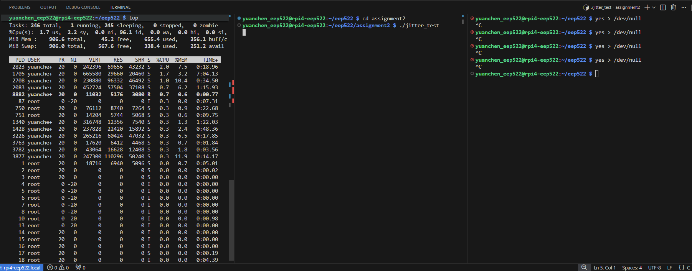
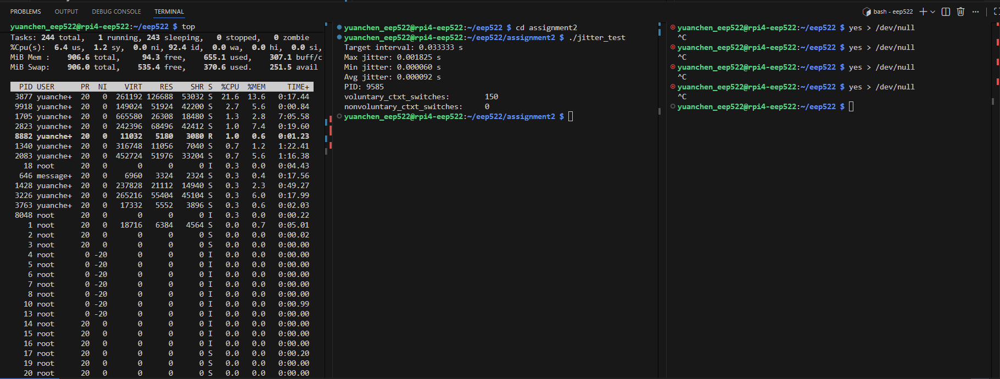
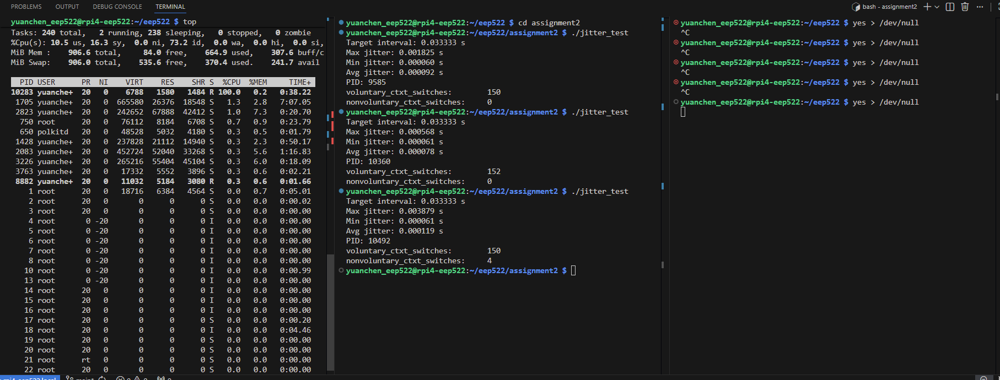

## CPU and Memory Bandwidth Characterization

### Objective

The objective of this experiment was to evaluate how image resolution and frame rate affect CPU utilization and memory bandwidth on the Raspberry Pi platform. The experiment simulates a camera workload by copying frame-sized memory buffers at a controlled frame rate.

This exploration aims to understand whether the system is compute-bound or memory-bound when processing image-like data streams.

---

### Experimental Setup

A C program was developed to simulate camera frame processing. The program:

- Allocates two frame-sized memory buffers
- Copies one buffer into another using `memcpy`
- Controls execution rate using `usleep()` to simulate FPS
- Runs for a fixed duration of 5 seconds
- Measures execution time using `clock_gettime()`
- CPU utilization measured using the Linux `time` utility

Frame size calculation:

- RGB888 format (3 bytes per pixel)
- Frame size = width × height × 3

Test configurations:

| Resolution | FPS | Frame Size |
|------------|-----|------------|
| 1280 × 720 | 15  | 2.64 MB |
| 1920 × 1080 | 30 | 5.93 MB |

---

### Results

#### 720p @ 15 FPS

## CPU and Memory Bandwidth Characterization

### Objective

The objective of this experiment was to evaluate how image resolution and frame rate affect CPU utilization and memory bandwidth on the Raspberry Pi platform. The experiment simulates a camera workload by copying frame-sized memory buffers at a controlled frame rate.

This exploration aims to understand whether the system is compute-bound or memory-bound when processing image-like data streams.

---

### Experimental Setup

A C program was developed to simulate camera frame processing. The program:

- Allocates two frame-sized memory buffers
- Copies one buffer into another using `memcpy`
- Controls execution rate using `usleep()` to simulate FPS
- Runs for a fixed duration of 5 seconds
- Measures execution time using `clock_gettime()`
- CPU utilization measured using the Linux `time` utility

Frame size calculation:

- RGB888 format (3 bytes per pixel)
- Frame size = width × height × 3

Test configurations:

| Resolution | FPS | Frame Size |
|------------|-----|------------|
| 1280 × 720 | 15  | 2.64 MB |
| 1920 × 1080 | 30 | 5.93 MB |

---

### Results

#### 720p @ 15 FPS
```
real ≈ 5.05 s
user ≈ 0.109 s
sys ≈ 0.004 s
```
Estimated CPU utilization:

CPU ≈ (user + sys) / real  
CPU ≈ (0.109 + 0.004) / 5.05 ≈ 2.2%

Theoretical memory traffic:

2.64 MB × 15 FPS ≈ 39.6 MB/s

---

#### 1080p @ 30 FPS
```
real ≈ 5.03 s
user ≈ 0.369 s
sys ≈ 0.025 s
```
Estimated CPU utilization:

CPU ≈ (0.369 + 0.025) / 5.03 ≈ 7.8%

Theoretical memory traffic:

5.93 MB × 30 FPS ≈ 177.9 MB/s

---

### Analysis

The experimental results show approximately a 4× increase in CPU utilization when increasing both resolution and frame rate.

This aligns with the theoretical scaling of memory traffic:

- Resolution increase ≈ 2.2×
- FPS increase ≈ 2×
- Total memory traffic ≈ 4.4×

The measured CPU increase closely matches the expected increase in memory bandwidth demand.

This indicates that the workload is primarily **memory-bandwidth bound**, rather than compute-bound.

---

### Observations

- CPU utilization remains relatively low (<10%) even at 1080p @ 30 FPS.
- The Raspberry Pi platform has significant headroom for additional processing.
- Frame processing workload scales approximately linearly with memory traffic.
- System behavior appears deterministic under controlled frame rates.

---

### Insight

In image-processing workloads, memory bandwidth can become the dominant bottleneck rather than arithmetic computation. Resolution and frame rate directly affect memory traffic, which in turn determines CPU utilization.

This experiment provides a baseline understanding of system capacity before introducing additional processing such as image analysis or multithreading.

---







## Real-Time Behavior and Scheduling Analysis

### Objective

The objective of this experiment was to evaluate the timing determinism of periodic task execution on a Raspberry Pi running Linux. Specifically, the experiment aimed to measure:

- Frame interval stability (jitter)
- Context switch behavior
- The impact of CPU load on scheduling determinism

This helps characterize whether the platform behaves as a deterministic real-time system or as a soft real-time system under load.

---

### Methodology

A periodic task was implemented in C to simulate a 30 FPS workload. The program:

- Uses `usleep()` to wake up every 33.333 ms
- Measures actual elapsed time between wakeups using `clock_gettime()`
- Computes jitter as the difference between actual and target intervals
- Reports:
  - Maximum jitter
  - Minimum jitter
  - Average jitter
  - Voluntary and non-voluntary context switches from `/proc/self/status`

The test was executed for 5 seconds under two conditions:

1. Idle system (no additional load)
2. High CPU load using `yes > /dev/null`

---

### Results

#### Case 1: Idle System

```
Target interval: 0.033333 s
Max jitter: 0.000568 s
Min jitter: 0.000061 s
Avg jitter: 0.000078 s

voluntary_ctxt_switches: 152
nonvoluntary_ctxt_switches: 0
```

Observations:

- Voluntary context switches closely matched the expected sleep cycles (≈150 for 30 FPS × 5 s).
- No non-voluntary context switches occurred.
- Maximum jitter remained below 0.6 ms.
- CPU usage observed in `top` was low.

---

#### Case 2: High CPU Load (`yes > /dev/null`)

```
Target interval: 0.033333 s
Max jitter: 0.003879 s
Min jitter: 0.000061 s
Avg jitter: 0.000119 s

voluntary_ctxt_switches: 150
nonvoluntary_ctxt_switches: 4
```


Observations:

- Voluntary context switches remained consistent with expected sleep cycles.
- Non-voluntary context switches increased (4 occurrences).
- Maximum jitter increased significantly (≈3.9 ms).
- `top` indicated high CPU utilization due to the additional load process.

---

### Analysis

The results clearly demonstrate the impact of system load on scheduling determinism.

Under idle conditions:

- The periodic task executed with minimal jitter.
- No forced preemption occurred.
- The system behaved in a relatively deterministic manner.

Under high CPU load:

- Non-voluntary context switches were observed.
- Maximum jitter increased by approximately 7×.
- Scheduling interference from competing processes introduced measurable timing variability.

This confirms that Linux on Raspberry Pi behaves as a **soft real-time system**. While timing stability is acceptable under low load, deterministic guarantees cannot be maintained under CPU contention.

---

### Context Switch Interpretation

- `voluntary_ctxt_switches` correspond to explicit `usleep()` calls.
- `nonvoluntary_ctxt_switches` indicate scheduler preemption.
- The increase in non-voluntary switches under load directly correlates with increased jitter.

---

### Conclusion

This experiment demonstrates that:

- Periodic tasks on Linux exhibit low jitter under idle conditions.
- CPU load increases scheduler interference.
- Non-voluntary context switches are a measurable indicator of preemption.
- Timing determinism degrades under contention.

Therefore, the Raspberry Pi running standard Linux should be considered a **soft real-time platform**, suitable for latency-tolerant embedded workloads but not for hard real-time guarantees.

Figures from `top` illustrating CPU utilization under both conditions are included for reference.


## Multithreading: Race Condition and Mutex Synchronization

### Objective

The purpose of this experiment was to investigate race conditions in a multi-threaded environment and evaluate whether mutex synchronization eliminates non-deterministic behavior. Additionally, the impact of compiler optimization on observable race behavior was examined.

---

### Experimental Design

A shared global counter was incremented concurrently by two threads:

```
int counter = 0;

void* increment(void* arg)
{
    for (int i = 0; i < ITERATIONS; i++)
    {
        counter++;   // Not atomic
    }
    return NULL;
}
```
Two versions were tested:

Without mutex protection

With mutex protection

The expected final result was:

```
Expected = number_of_threads × ITERATIONS
```
The program was compiled using both -O0 and -O2 optimization levels.


### Results

#### Case 1: No Mutex, Compiled with `-O0`

```
Final counter = 10135379
Expected = 40000000
```

The final counter value was significantly lower than expected.  
Each execution produced different incorrect values.

This demonstrates a classic race condition.

---

#### Case 2: With Mutex, Compiled with `-O0`

```
Final counter = 40000000
Expected = 40000000
```

The result was consistently correct across all executions.

Mutex synchronization successfully eliminated concurrent memory corruption.

---

### Why the Race Occurs

The operation:

```
counter++
```

is not atomic. It consists of three steps:

1. Load `counter` from memory  
2. Add 1  
3. Store back to memory  

If two threads execute these steps simultaneously, the following can occur:

```
Thread A loads 10
Thread B loads 10
Thread A stores 11
Thread B stores 11
```

One increment is lost.

This results in a non-deterministic final counter value.

---

### Impact of Compiler Optimization

When compiled with `-O2`, the race condition sometimes appeared less frequently or did not immediately produce incorrect results.

However, this does not eliminate the race condition.

Compiler optimization changes instruction scheduling, register usage, and memory access patterns, which may reduce the probability of interleaving. The underlying data race remains present because the shared variable is not protected.

Race conditions represent undefined behavior and may manifest differently depending on:

- Optimization level  
- Scheduling  
- CPU architecture  
- System load  

Correctness must not rely on compiler behavior.

---

### Conclusion

This experiment demonstrates:

- Unsynchronized shared memory access leads to non-deterministic results.
- Race conditions may not always produce visible errors.
- Compiler optimization can change the probability of observable race behavior.
- Mutex synchronization guarantees correctness by enforcing mutual exclusion.

This confirms that multi-threaded embedded applications must use proper synchronization mechanisms to ensure data integrity, regardless of apparent behavior under certain build configurations.
